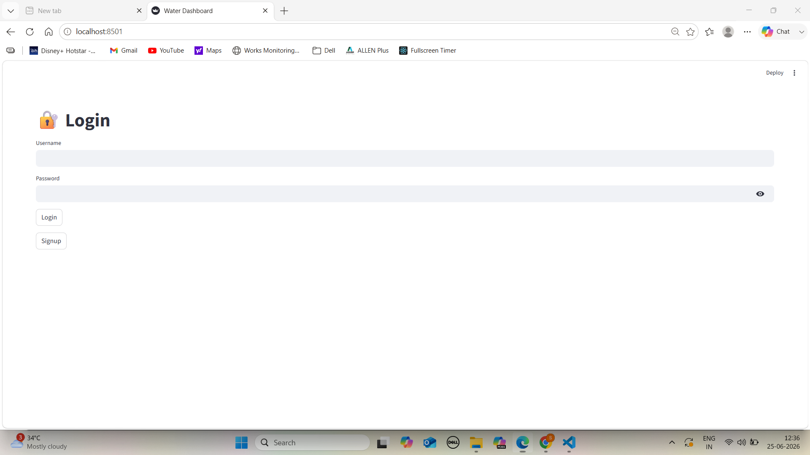
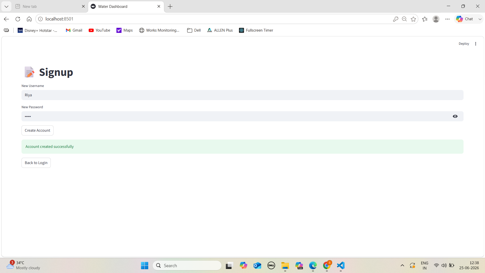
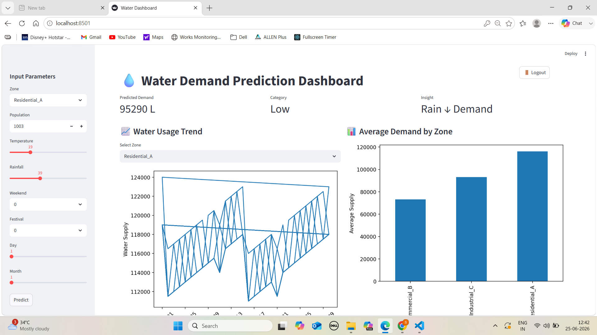

# 💧 Water Demand Prediction System

> A machine learning web application that predicts municipal water demand based on environmental and social factors — built to support smarter water resource planning for city administrators.

[](https://water-demand-prediction-knppdpyf3k9v8ir4knvovp.streamlit.app/)


🔗 **Live Demo:** https://water-demand-prediction-knppdpyf3k9v8ir4knvovp.streamlit.app/

---

## 📌 Problem Statement

Municipal water boards struggle to plan supply infrastructure because demand fluctuates with temperature, population, festivals, and rainfall. Manual forecasting leads to either shortages or wasteful over-supply.

This project predicts zone-wise daily water demand using a **Random Forest model** and presents results through an **interactive Streamlit dashboard** — designed for non-technical city planners.

---

## 🖥️ Screenshots

| Login | Signup | Dashboard |
|-------|--------|-----------|
|  |  |  |

---

## 👩‍💻 My Contribution — Sakshi Sharma

This was a **4-member academic group project**. My role was **UI Design & Output**:

- **Streamlit dashboard** — Designed and built the full frontend in `app.py` including layout, sidebar inputs, and page routing (Login → Signup → Dashboard)
- **Prediction output** — Built the 3-column metric display showing predicted demand, demand category (Low/Medium/High), and smart insights
- **Data visualisations** — Created zone-wise water usage trend (line graph) and average demand by zone (bar chart) using Matplotlib
- **Authentication UI** — Login and Signup screens with Streamlit session state management

> Other team members: Shreya Dubey · Unnati Chaurasia · Bhubnesh Sharma

---

## 📊 Model Performance

| Metric | Value |
|--------|-------|
| Algorithm | Random Forest Regressor |
| R² Score | **0.9966** |
| MAE | **246 litres** |
| Dataset | 540 records · 3 zones · 180 days |
| Demand range | 66,000 – 124,000 litres/day |

> ⚠️ Uses **synthetic data** generated via `generate_data.py` — not real municipal records.
> User auth stores passwords in plain JSON — not production-grade.

---

## 🛠️ Tech Stack

| Layer | Tools |
|-------|-------|
| Language | Python 3.10 |
| ML | Scikit-learn — RandomForestRegressor |
| Data | Pandas |
| Dashboard | Streamlit |
| Visualisation | Matplotlib |
| Auth | JSON-based login/signup |

---

## 📂 Input Features

| Feature | Type | Description |
|---------|------|-------------|
| Zone | Categorical | Residential_A / Commercial_B / Industrial_C |
| Population | Numeric | Zone population (1,000 – 10,000) |
| Temperature | Numeric | Daily avg temperature °C |
| Rainfall | Numeric | Rainfall in mm |
| Weekend | Binary | 1 = Weekend |
| Festival | Binary | 1 = Festival day |
| Day | Numeric | Day of month (1–31) |
| Month | Numeric | Month (1–12) |

**Target:** `water_supply` — predicted demand in litres

---

## 🚀 How to Run Locally

```bash
# 1. Clone the repo
git clone https://github.com/sakshis937/water-demand-prediction.git
cd water-demand-prediction

# 2. Install dependencies
pip install -r requirements.txt

# 3. Generate dataset
python generate_data.py

# 4. Train the model
python model.py

# 5. Launch the app
streamlit run app.py
```

**Login credentials:** Username: `sakshi` · Password: `123123`

---

## 📁 Project Structure

```
water-demand-prediction/
│
├── app.py                   # Streamlit app — login, prediction, dashboard
├── model.py                 # Random Forest training + evaluation
├── generate_data.py         # Synthetic dataset generator
├── water_data_big.csv       # Generated dataset (540 rows)
├── model.pkl                # Trained and saved model
├── users.json               # User credentials
├── requirements.txt         # Python dependencies
├── images/
│   ├── login.png            # Login page screenshot
│   ├── signup.png           # Signup page screenshot
│   └── dashboard.png        # Dashboard screenshot
└── README.md
```

---

## 💡 Key Learnings

- Random Forest achieves high R² on synthetic data — real-world data would be noisier
- UI clarity matters as much as model accuracy when building for non-technical users
- Streamlit session state is essential for multi-page apps with authentication

---

## 👥 Team

| Name | Role |
|------|------|
| **Sakshi Sharma** | UI Design & Output — dashboard, charts, prediction display |
| Shreya Dubey | Testing & documentation |
| Unnati Chaurasia | Data & model development |
| Bhubnesh Sharma | Presentation & reporting |

---

📧 sakshis93737@gmail.com · [LinkedIn](https://linkedin.com/in/sakshi-sharma-610956326) · [GitHub](https://github.com/sakshis937)
